**Частина 1 - Проєктування схеми**

**1. Опис схеми графа: які сутності стали вузлами, а які — ребрами?**

У нашій графовій моделі ми використовуємо три типи сутностей: вузли (Nodes) та два типи зв'язків як ребра (Relationships).

Вузли (Nodes):

User (Користувач). Властивості: userId (унікальний ідентифікатор), gender (стать), age (вік), occupation (професія). Ми робимо користувача вузлом, оскільки це самостійний об'єкт, який виконує дії в нашій системі.

Movie (Фільм). Властивості: movieId (унікальний ідентифікатор), title (назва), year (рік випуску). Це головний об'єкт, з яким взаємодіють користувачі.

Genre (Жанр). Властивості: name (назва жанру, наприклад, "Action"). Це окрема сутність для зручної категоризації фільмів.

Ребра (Relationships):

RATED (Оцінив). Напрямок: від User до Movie. Властивості: rating (сама оцінка від 1 до 5), timestamp (час оцінювання). Цей зв'язок показує факт взаємодії користувача з фільмом.

HAS_GENRE (Має жанр). Напрямок: від Movie до Genre. Без властивостей. Цей зв'язок просто вказує на приналежність фільму до певної категорії.

**2. Чому оцінка користувача за фільм — це ребро (User)-[:RATED]->(Movie), а не окремий вузол (Rating)?**

Зберігання оцінки як зв'язку (ребра) є набагато ефективнішим і логічнішим у Neo4j з кількох причин:

Швидкість запитів: Якщо зробити оцінку вузлом, шлях буде виглядати так: (User)-[:GAVE]->(Rating)-[:TO]->(Movie). Щоб дізнатися, що подивився користувач, базі доведеться робити два кроки замість одного. Це суттєво уповільнить роботу рекомендаційного алгоритму.

Економія пам'яті: У нашому датасеті 1 мільйон оцінок. Якщо зробити кожну оцінку окремим вузлом, ми створимо 1 мільйон зайвих вузлів і 2 мільйони зайвих зв'язків. Зберігаючи оцінку як властивість зв'язку RATED, ми зберігаємо базу компактною.

Графова філософія: У графах вузли — це зазвичай іменники (хто? що?), а ребра — дієслова (що зробив?). Користувач "оцінив" фільм. Оцінка — це характеристика самої дії (наскільки сильно оцінив), тому її місце саме всередині ребра.

**3. Чому жанри фільму вигідніше зберігати як окремі вузли (Genre), а не як список у властивості вузла Movie?**

Виділення жанрів в окремі вузли дає величезну перевагу у швидкості пошуку та аналізі даних:

Швидка фільтрація: Якби жанри були просто текстом у фільмі (наприклад, genres: ['Action', 'Comedy']), то для пошуку всіх комедій базі довелося б перевірити кожен із майже 4000 фільмів. Коли жанр є окремим вузлом (Genre {name: 'Comedy'}), база миттєво знаходить цей один вузол і просто йде по його зв'язках у зворотному напрямку, отримуючи всі комедії за частки секунди.

Рекомендації (Алгоритми): Окремі вузли жанрів дозволяють легко знаходити "схожі фільми". Якщо два різні фільми пов'язані з вузлом "Sci-Fi", база розуміє, що вони мають спільний контекст, і може рекомендувати один замість іншого. Зі списком у властивостях будувати такі графи подібності набагато складніше.

**4. ASCII-діаграма схеми графа**

Plaintext
+-------------------+                    +-------------------+
|      :User        |                    |      :Movie       |
|-------------------|                    |-------------------|
| userId: Integer   |     :RATED         | movieId: Integer  |
| gender: String    | -----------------> | title: String     |
| age: Integer      |  {rating: Float,   | year: Integer     |
| occupation: Int   |   timestamp: Int}  +-------------------+
+-------------------+                              |
                                                   | :HAS_GENRE
                                                   V
                                         +-------------------+
                                         |      :Genre       |
                                         |-------------------|
                                         | name: String      |
                                         +-------------------+

**Частина 3 - Запити різної складності**

**Запит 1. Знайти всі фільми жанру «Thriller» із середнім рейтингом вище 4.0**

MATCH (m:Movie)-[:HAS_GENRE]->(g:Genre {name: 'Thriller'})
MATCH (u:User)-[r:RATED]->(m)
WITH m, avg(r.rating) AS avgRating
WHERE avgRating > 4.0
RETURN m.title AS MovieTitle, avgRating AS AverageRating
ORDER BY avgRating DESC
LIMIT 10;

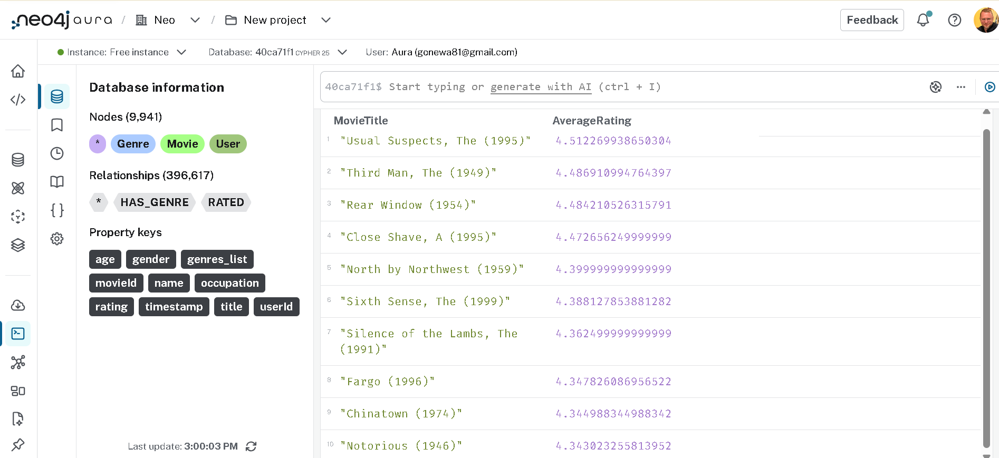

**Як працює цей код**

MATCH (m:Movie)-[:HAS_GENRE]->(g:Genre {name: 'Thriller'}): Ми просимо базу знайти всі вузли фільмів, які мають зв'язок із вузлом жанру, де назва жанру — 'Thriller'. (Тут ми якраз бачимо перевагу того, що винесли жанри в окремі вузли!)

MATCH (u:User)-[r:RATED]->(m): Далі для цих знайдених фільмів ми шукаємо всі оцінки r, які поставили будь-які користувачі.

WITH m, avg(r.rating) AS avgRating: Це аналог GROUP BY в SQL. Ми беремо фільм і вираховуємо середнє арифметичне всіх його оцінок, називаючи це avgRating.

WHERE avgRating > 4.0: Відсіюємо ті фільми, які не дотягують до оцінки 4.0.

RETURN ... ORDER BY ... LIMIT 10: Виводимо назву та рейтинг, сортуємо від найвищого до найнижчого і показуємо лише перші 10 результатів для зручності.

**Запит 2. Знайти користувачів, які поставили оцінку 5 більш ніж 50 фільмам**

MATCH (u:User)-[r:RATED]->(m:Movie)
WHERE r.rating = 5
WITH u, count(m) AS fiveStarCount
WHERE fiveStarCount > 50
RETURN u.userId AS UserID, fiveStarCount AS MoviesCount
ORDER BY fiveStarCount DESC
LIMIT 10;

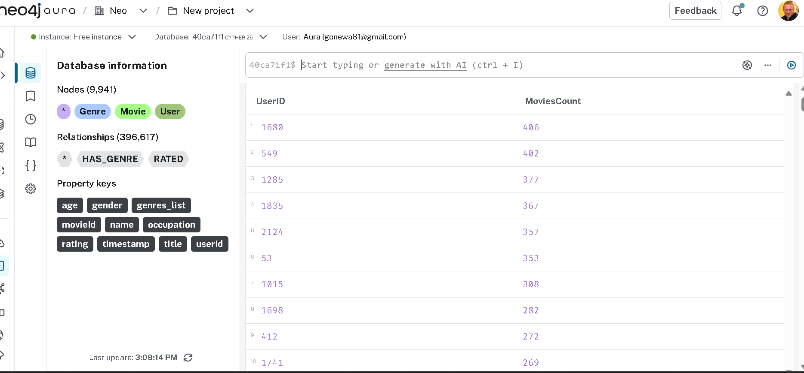

**Як працює цей код**

MATCH (u:User)-[r:RATED]->(m:Movie): Ми знаходимо всі зв'язки, де будь-який користувач оцінив будь-який фільм.

WHERE r.rating = 5: Одразу відфільтровуємо лише ті зв'язки (ребра), де оцінка дорівнює рівно 5.

WITH u, count(m) AS fiveStarCount: Групуємо результати по кожному користувачу (u) і рахуємо кількість фільмів (count(m)), яким він поставив п'ятірку. Називаємо цю кількість fiveStarCount.

WHERE fiveStarCount > 50: Залишаємо лише тих користувачів, у яких ця кількість перевищує 50.

RETURN ... ORDER BY ... LIMIT 10: Виводимо ID користувача та його кількість п'ятірок, сортуємо від найбільшого до найменшого і показуємо топ-10 результатів.

**Запит 3. Знайти фільми, які обидва користувачі оцінили високо**

MATCH (u1:User {userId: 1})-[r1:RATED]->(m:Movie)<-[r2:RATED]-(u2:User {userId: 2})
WHERE r1.rating >= 4 AND r2.rating >= 4
RETURN m.title AS MovieTitle, r1.rating AS User1Rating, r2.rating AS User2Rating
ORDER BY MovieTitle
LIMIT 10;

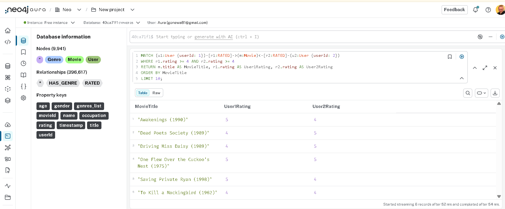

**Як працює цей код**

MATCH (u1:User {userId: 1})-[r1:RATED]->(m:Movie)<-[r2:RATED]-(u2:User {userId: 2}): Це найцікавіший рядок. Ми візуально малюємо патерн (шаблон) у графі. Ми кажемо базі: "Знайди Користувача 1, який оцінив якийсь Фільм m, і перевір, чи Користувач 2 також має зв'язок оцінки до цього ж самого Фільму m".

WHERE r1.rating >= 4 AND r2.rating >= 4: Ми фільтруємо результати, залишаючи лише ті випадки, де обидві оцінки на цьому перетині є високими (більше або дорівнює 4).

RETURN ... ORDER BY ... LIMIT 10: Виводимо назву спільного фільму та оцінки, які поставив кожен із користувачів. Сортуємо за алфавітом і показуємо перші 10 штук.

**Запит 4. Знайти жанри, чиї фільми стабільно отримують високі оцінки**

MATCH (g:Genre)<-[:HAS_GENRE]-(m:Movie)<-[r:RATED]-()
WITH g.name AS Genre, avg(r.rating) AS AverageRating, count(r) AS RatingsCount
WHERE RatingsCount > 1000
RETURN Genre, AverageRating, RatingsCount
ORDER BY AverageRating DESC
LIMIT 10;

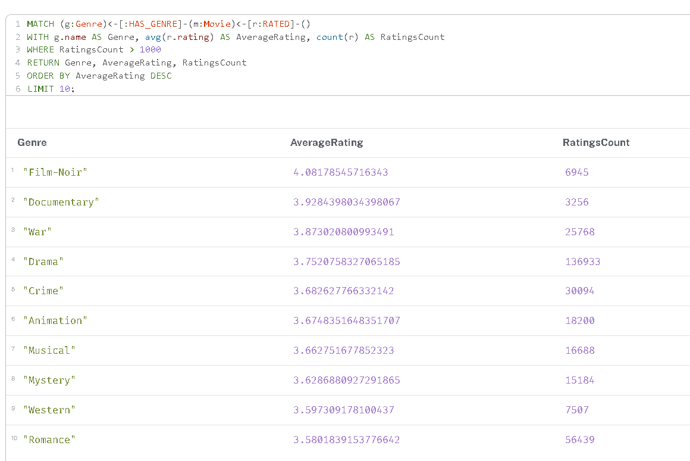

**Як працює цей код**

MATCH (g:Genre)<-[:HAS_GENRE]-(m:Movie)<-[r:RATED]-(): Ми будуємо ланцюжок від жанру до фільму, і від фільму до всіх його оцінок. Залишили дужки () порожніми біля зв'язку RATED, бо нам зараз не важливі конкретні користувачі, лише самі оцінки.

WITH g.name AS Genre, avg(r.rating) AS AverageRating, count(r) AS RatingsCount: Ми групуємо результати за назвою жанру, вираховуємо середнє арифметичне всіх оцінок (avg) та рахуємо їхню загальну кількість (count).

WHERE RatingsCount > 1000: Ставимо умову, щоб кількість оцінок була більшою за 1000. Це гарантує, що високий рейтинг є статистично значущим і стабільним, а не випадково поставленим кількома людьми.

RETURN ... ORDER BY AverageRating DESC LIMIT 10: Виводимо результати на екран, сортуючи жанри від найвищого середнього рейтингу до найнижчого.

**Запит 5. Рекомендація «користувачі зі схожими смаками також дивилися»**

// Знаходимо користувача та інших людей, які високо оцінили ті ж самі фільми
MATCH (u:User {userId: 1})-[r1:RATED]->(m1:Movie)<-[r2:RATED]-(similarUser:User)
WHERE r1.rating >= 4 AND r2.rating >= 4

// Шукаємо інші фільми, які високо оцінили ці "схожі" користувачі
MATCH (similarUser)-[r3:RATED]->(m2:Movie)
WHERE r3.rating >= 4

// Виключаємо фільми, які наш цільовий користувач уже бачив
AND NOT (u)-[:RATED]->(m2)

// Рахуємо, скільки схожих користувачів рекомендують кожен фільм
WITH m2, count(DISTINCT similarUser) AS recommendationScore
ORDER BY recommendationScore DESC
LIMIT 10

RETURN m2.title AS RecommendedMovie, recommendationScore AS Score;

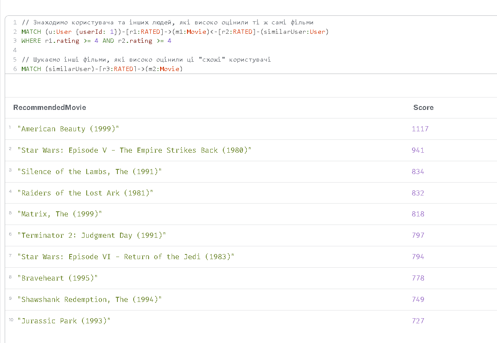

**Як працює цей код**

MATCH (u...)-[r1...]->(m1)<-[r2...]-(similarUser): Ми знаходимо нашого користувача (u), фільми, які він оцінив (m1), і знаходимо інших людей (similarUser), які теж оцінили ці фільми.

WHERE r1.rating >= 4 AND r2.rating >= 4: Залишаємо лише ті перетини, де і наш користувач, і "схожий" користувач поставили оцінку 4 або 5. Це означає, що їхні смаки збігаються.

MATCH (similarUser)-[r3:RATED]->(m2:Movie): Дивимося, які ще фільми (m2) оцінювали ці схожі користувачі.

WHERE r3.rating >= 4 AND NOT (u)-[:RATED]->(m2): Це ключовий момент! Ми беремо лише ті нові фільми, яким ставили високі оцінки, і за допомогою NOT переконуємося, що наш головний користувач їх ще не оцінював (не бачив).

WITH ... count(DISTINCT similarUser) AS recommendationScore: Ми підраховуємо, скільки унікальних "схожих" користувачів вподобали цей новий фільм. Це буде нашою оцінкою релевантності. Чим більше схожих людей вподобали фільм, тим вище він у топі.

**Запит 6. Знайти найкоротший ланцюжок зв’язку між двома користувачами через спільні фільми**

MATCH (u1:User {userId: 1}), (u2:User {userId: 3})
MATCH p = shortestPath((u1)-[:RATED*..6]-(u2))
RETURN p, length(p) AS pathLength;

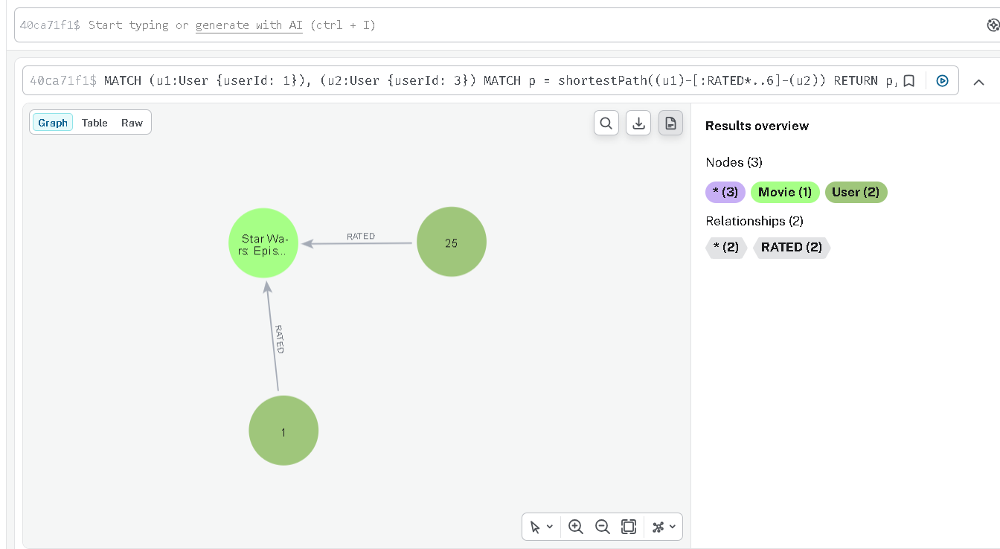

**Як працює цей код**

MATCH (u1...), (u2...): Знаходимо початкового та кінцевого користувачів.

shortestPath(...): Це вбудований алгоритм бази, який шукає найкоротший маршрут між двома вузлами.

[:RATED*..6]: Зірочка означає, що ми шукаємо шлях змінної довжини (від 1 до 6 кроків). Ми обмежуємо пошук 6 кроками (хопами), щоб база не зависла, перебираючи мільйони комбінацій.

length(p): Виводить довжину знайденого шляху в кількості кроків (ребер).

**Що означає довжина шляху в даному контексті? Один хоп - це один крок по ребру RATED, а значить - шлях довжини 2 означає, що два користувачі оцінили один і той самий фільм. Як інтерпретувати шлях довжини 4? Довжини 6?**

У графовій базі даних довжина шляху - це кількість зв'язків (ребер), які ми маємо пройти, щоб дістатися від стартового вузла до кінцевого. Кожен пройдений зв'язок - це рівно один крок (хоп).

Шлях довжини 2 (Прямий спільний інтерес). Структура ланцюжка: (Користувач 1) ➔ [ОЦІНИВ] ➔ (Фільм А) 🡄 [ОЦІНИВ] 🡄 (Користувач 2). Це означає, що двоє людей подивилися і оцінили один і той самий фільм. Їх об'єднує прямий спільний інтерес, і вони знаходяться найближче один до одного у графі.

Шлях довжини 4 (Зв'язок через одного посередника). Структура ланцюжка: (Користувач 1) ➔ (Фільм А) 🡄 (Користувач 2) ➔ (Фільм Б) 🡄 (Користувач 3). У цьому випадку Користувач 1 і Користувач 3 не дивилися жодного спільного фільму. Проте їх об'єднує Користувач 2. Користувач 1 має спільний смак із Користувачем 2 (через Фільм А), а той, у свою чергу, має спільний смак із Користувачем 3 (через Фільм Б).

Шлях довжини 6 (Зв'язок через двох посередників). Структура ланцюжка: (Користувач 1) ➔ (Фільм А) 🡄 (Користувач 2) ➔ (Фільм Б) 🡄 (Користувач 3) ➔ (Фільм В) 🡄 (Користувач 4). Ланцюжок стає ще довшим. Тепер між стартовим Користувачем 1 та кінцевим Користувачем 4 стоять уже дві людини-посередники.

У рекомендаційних системах парні довжини шляхів (2, 4, 6, 8...) завжди з'єднують Користувача з Користувачем, а непарні (1, 3, 5...) - Користувача з Фільмом.

Чим коротший шлях (наприклад, 2), тим сильніша і ближча схожість між глядачами - вони ідеально підходять для того, щоб алгоритм рекомендував їм фільми один одного. Шляхи довжини 4, 6 і більше чудово ілюструють теорію "шести рукостискань": вони показують, що мережа дуже розгалужена, але сам зв'язок між смаками людей на таких відстанях стає набагато слабшим і віддаленішим.

**Частина 4 - Виявлення супервузлів**

**Крок 1. Запит для пошуку вузлів із найбільшою кількістю ребер**

MATCH (n)
WITH n, COUNT { (n)--() } AS rel_count
ORDER BY rel_count DESC
LIMIT 10
RETURN labels(n)[0] AS NodeType, 
       coalesce(n.title, n.name, toString(n.userId)) AS NodeName, 
       rel_count AS TotalRelationships;

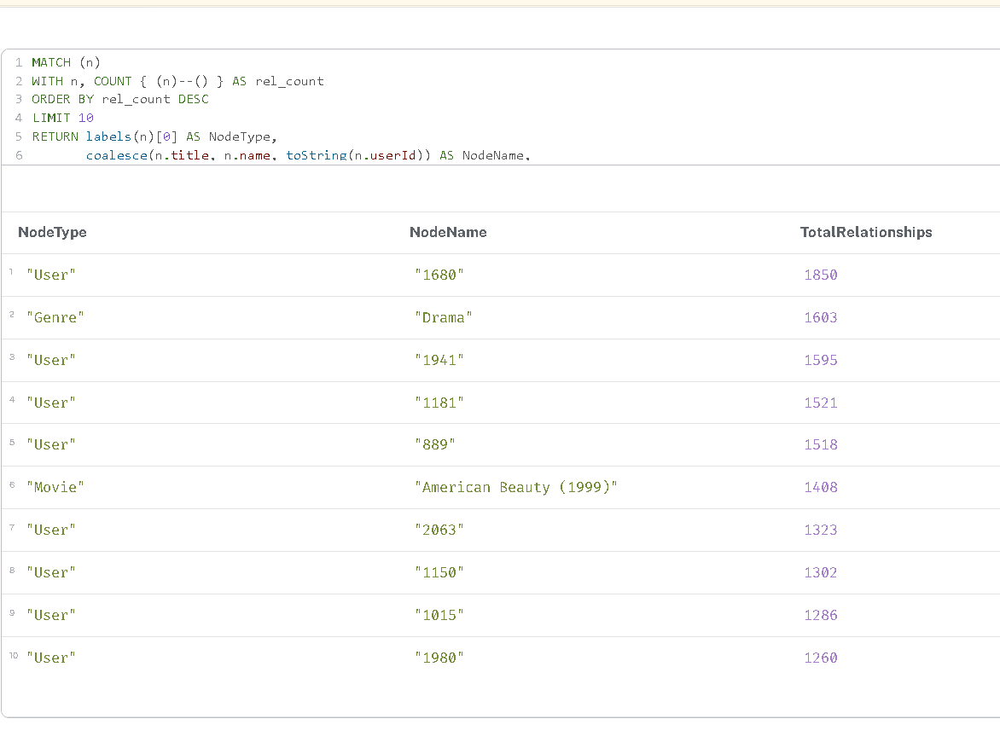

**Як працює цей код**

MATCH (n): Цей рядок захоплює абсолютно всі вузли, які існують у нашій базі даних, незалежно від їхнього типу.

WITH n, COUNT { (n)--() } AS rel_count: Це ключова частина запиту. Для кожного знайденого вузла n база миттєво підраховує кількість усіх зв'язків (ребер), які до нього підходять або від нього відходять. Шаблон --() означає «будь-який зв'язок у будь-якому напрямку». Результат цього підрахунку ми зберігаємо у змінну з назвою rel_count.

ORDER BY rel_count DESC: Ми вказуємо базі відсортувати всі вузли за кількістю їхніх зв'язків у порядку спадання (від найбільшого значення до найменшого).

LIMIT 10: Оскільки вузлів тисячі, ми обмежуємо вивід, щоб побачити лише першу десятку «рекордсменів».

RETURN labels(n)[0] AS NodeType: Ця команда бере тип вузла (його лейбл, наприклад, User, Genre або Movie) і виводить його в колонку під назвою NodeType.

coalesce(n.title, n.name, toString(n.userId)) AS NodeName: Функція coalesce — це дуже зручний інструмент, який бере перше непорожнє значення зі списку. Оскільки фільми мають title, жанри мають name, а користувачі — userId, ця функція дозволяє нам вивести правильну назву для будь-якого типу вузла в одну загальну колонку NodeName. Функція toString() перетворює числове ID користувача на текст.

rel_count AS TotalRelationships: Виводить підраховану раніше кількість зв'язків у фінальну таблицю.

**1. Які вузли виявилися супервузлами? Скільки у них зв’язків?**

Виконавши запит на пошук вузлів із найбільшою кількістю ребер, я виявив, що супервузлами у нашому графі виступають найактивніші користувачі, популярні жанри та культові фільми. Згідно з отриманими результатами:

Найбільшим супервузлом є вузол користувача (User з ID "1680"), який має 1850 зв'язків.

Серед жанрів найбільшим супервузлом є "Drama" (Genre), який об'єднує 1603 зв'язки.

Найпопулярніший фільм-супервузол — "American Beauty (1999)" (Movie), який має 1408 зв'язків.

**2. Чому запит, що зачіпає такий вузол, працює повільніше, ніж запит по «звичайному» вузлу з тими самими індексами?**

Це класична проблема графових баз даних, яка називається "проблемою щільного вузла" (dense node problem). Індекс дозволяє базі швидко знайти стартовий вузол (наприклад, фільм за його назвою). Але коли алгоритму потрібно зробити крок (хоп) далі по графу, база змушена завантажити в оперативну пам'ять абсолютно всі зв'язки цього вузла.

Якщо ми проходимо через звичайний непопулярний фільм, база перевіряє 20-30 зв'язків за мілісекунду. Якщо ж ми йдемо через жанр "Drama", базі доводиться зчитувати, завантажувати і фільтрувати понад 1600 зв'язків одночасно, навіть якщо нам потрібен був лише один конкретний шлях. Це створює величезне навантаження на процесор та сповільнює виконання запиту.

**3. Яку конкретну стратегію з лекцій ви б застосували для цього датасету? Що робити з жанрами?**

Жанрові вузли є типовими супервузлами. Прохід через них під час пошуку рекомендацій створює величезне навантаження, оскільки вони об'єднують тисячі фільмів і викликають експоненціальне зростання кількості варіантів шляху.

Найкраща стратегія для вирішення цієї проблеми у нашому датасеті - денормалізація.

Замість того, щоб зберігати жанри як окремі вузли і з'єднувати їх ребрами HAS_GENRE, необхідно перенести інформацію про жанр безпосередньо всередину вузла Movie. Це реалізується шляхом додавання до фільму властивості-масиву (наприклад, genres: ['Drama', 'Comedy']) або набору булевих прапорців (наприклад, isDrama: true). Це повністю усуне жанрові супервузли зі структури графа, а фільтрація за жанром перетвориться на миттєве читання властивостей самого фільму.

**Частина 5 - Графові алгоритми через GDS**

**5.1. PageRank на графі фільмів**

**Крок 1: Створення зв'язків між фільмами (матеріалізація)**

MATCH (m1:Movie)<-[r1:RATED]-(u:User)-[r2:RATED]->(m2:Movie)
WHERE r1.rating >= 4 AND r2.rating >= 4 AND id(m1) < id(m2)
WITH m1, m2, count(u) AS weight
WHERE size([(m1)<-[:RATED]-() | 1]) > 20
  AND size([(m2)<-[:RATED]-() | 1]) > 20
WITH m1, m2, weight
ORDER BY weight DESC
LIMIT 2000
MERGE (m1)-[co:CO_RATED]-(m2)
SET co.weight = weight;

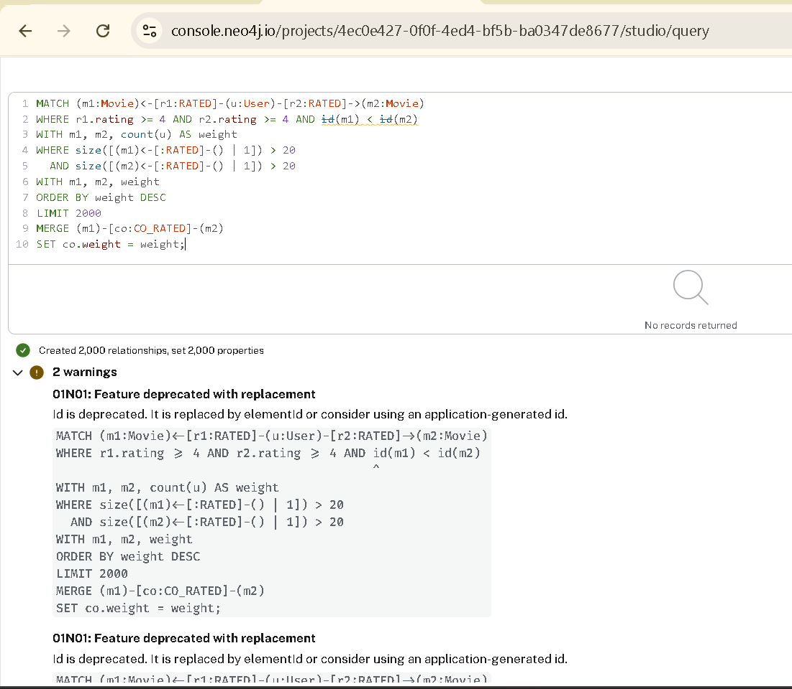

**Як працює цей код:**

MATCH (m1:Movie)<-[r1:RATED]-(u:User)-[r2:RATED]->(m2:Movie): Цей рядок шукає в базі візуальний шаблон: ми знаходимо одного користувача (u), який подивився та оцінив два різні фільми (m1 та m2).

WHERE r1.rating >= 4 AND r2.rating >= 4 AND id(m1) < id(m2): Ми фільтруємо результати, залишаючи лише ті випадки, де користувачу дуже сподобалися обидва фільми (рейтинг 4 і вище). Умова id(m1) < id(m2) — це трюк для оптимізації, щоб база не рахувала ту саму пару фільмів двічі (наприклад, спочатку зв'язок від Фільму А до Фільму Б, а потім від Фільму Б до Фільму А).

WITH m1, m2, count(u) AS weight: Ми беремо знайдену пару фільмів і рахуємо, скільки саме унікальних користувачів їх високо оцінили разом. Отримане число ми зберігаємо під назвою weight (вага зв'язку).

WHERE size([(m1)<-[:RATED]-() | 1]) > 20 AND size([(m2)<-[:RATED]-() | 1]) > 20: Тут база швидко підраховує загальну кількість оцінок, які має кожен із фільмів у всій базі. Ми залишаємо лише ті фільми, які сумарно мають більше ніж 20 оцінок. Це дозволяє нам відсіяти непопулярні чи дуже нішеві фільми, зосередившись на загальних трендах.

WITH m1, m2, weight: Ми передаємо відфільтровані пари фільмів і їхню "вагу" на наступний етап.

ORDER BY weight DESC: Ми сортуємо наш список пар від найсильнішого зв'язку (найбільше спільних фанатів) до найслабшого.

LIMIT 2000: Ми обмежуємо роботу запиту, щоб він обробив лише верхню частину списку.

MERGE (m1)-[co:CO_RATED]-(m2): Ця команда створює нове ребро (зв'язок) з назвою CO_RATED між двома фільмами прямо в базі даних. MERGE працює розумно: якщо такий зв'язок між цими фільмами вже існує, він просто його знайде, а якщо ні — створить новий.

SET co.weight = weight: Ми записуємо підраховану "вагу" у властивості цього нового зв'язку. Саме на цю цифру пізніше спиратиметься алгоритм PageRank для своїх розрахунків.

**Крок 2: Створення проєкції в пам'яті GDS**

CALL gds.graph.project(
  'movieGraph',
  'Movie',
  'CO_RATED',
  {
    relationshipProperties: ['weight'],
    undirectedRelationshipTypes: ['CO_RATED'],
    memory: '2GB'
  }
)
YIELD graphName, nodeCount, relationshipCount;

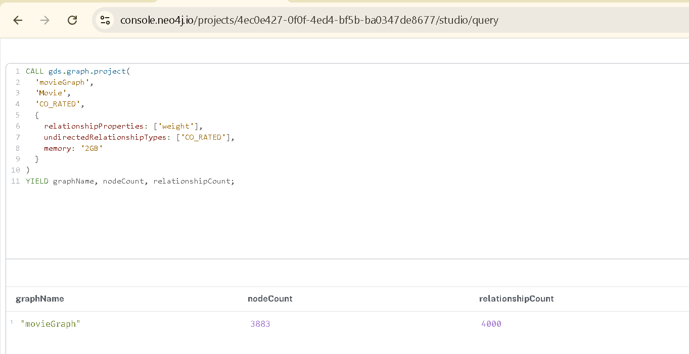

**Як працює цей код:**

CALL gds.graph.project(...): Це команда для запуску інструменту, який копіює потрібну частину бази даних в оперативну пам'ять комп'ютера (створює віртуальний граф). Це потрібно, щоб математичні алгоритми працювали максимально швидко.

'movieGraph': Це назва нашого віртуального графа.

'Movie': Ми вказуємо, що хочемо завантажити в пам'ять лише вузли з типом "Фільм", відкидаючи користувачів та жанри.

'CO_RATED': Ми явно вказуємо назву зв'язку (ребра), яку хочемо аналізувати.

relationshipProperties: ['weight']: Ми повідомляємо алгоритму, що під час аналізу потрібно враховувати властивість weight (нашу кількість спільних оцінок).

undirectedRelationshipTypes: ['CO_RATED']: Цей параметр каже базі ігнорувати напрямок стрілочок для цих зв'язків, роблячи їх повністю двосторонніми.

memory: '2GB': Це ключовий параметр, який усунув помилку хмари. У віддалених сесіях часто потрібно явно виділити квоту оперативної пам'яті (тут це 2 гігабайти) для створення віртуального середовища, інакше система блокує процес з міркувань безпеки.

YIELD graphName, nodeCount, relationshipCount: Ця команда повертає і виводить на екран підсумкову статистику: назву створеного графа, скільки вузлів і скільки зв'язків успішно завантажилося в пам'ять.

**Крок 3: Запуск алгоритму PageRank**

CALL gds.pageRank.stream('movieGraph')
YIELD nodeId, score
RETURN gds.util.asNode(nodeId).title AS MovieTitle, score AS PageRankScore
ORDER BY score DESC
LIMIT 10;

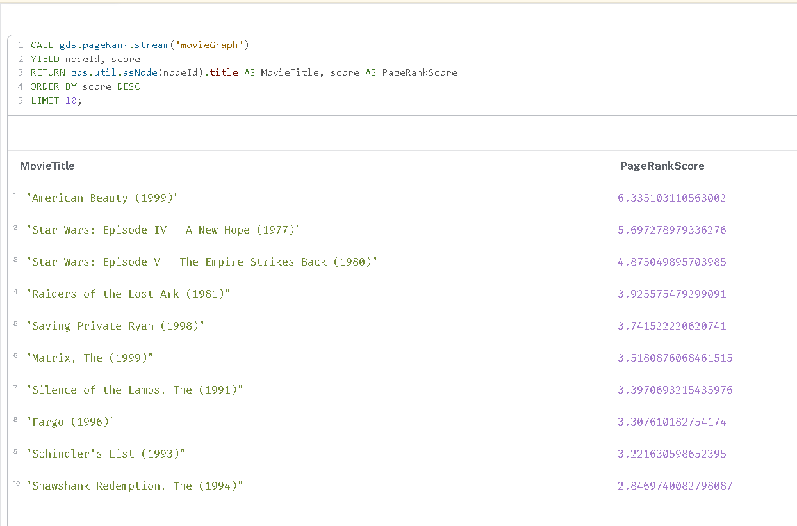

**Як працює цей код:**

CALL gds.pageRank.stream('movieGraph'): Ця команда запускає сам алгоритм PageRank для нашого віртуального графа, який ми завантажили в оперативну пам'ять на попередньому кроці. Функція stream означає, що результати будуть просто виведені на екран (як потік даних), а не записані назавжди на жорсткий диск бази даних.

Змінна 'movieGraph': Це назва нашої проєкції.

YIELD nodeId, score: Ця команда отримує (або «витягує») результати роботи математичного алгоритму. Вона бере внутрішній системний номер вузла (nodeId) та розрахований для нього бал важливості (score).

RETURN gds.util.asNode(nodeId).title AS MovieTitle, score AS PageRankScore: Оскільки алгоритм працює дуже швидко і повертає лише сухі цифри (ідентифікатори), ми використовуємо зручну функцію gds.util.asNode(), щоб перетворити цей числовий ідентифікатор назад на зрозумілий вузол бази даних і взяти з нього властивість назви фільму (title). Далі ми гарно виводимо цю назву і бал у відповідних колонках.

ORDER BY score DESC: Ця команда сортує отриманий список фільмів. Слово DESC означає сортування за спаданням — від найвищого бала (найвпливовішого фільму) до найнижчого.

LIMIT 10: Ми обмежуємо вивід на екран, щоб побачити лише топ-10 абсолютних лідерів нашого рейтингу.

**Крок 4: Прибирання за собою**

CALL gds.graph.drop('movieGraph');
MATCH ()-[co:CO_RATED]-() DELETE co;

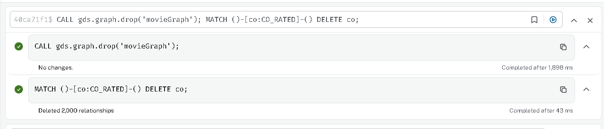

**Як працює цей код:**

CALL gds.graph.drop('movieGraph'): Ця вбудована функція безпечно видаляє нашу віртуальну проєкцію графа з оперативної пам'яті сервера бази даних, повністю звільняючи ресурси системи.

Змінна 'movieGraph': Це назва нашої проєкції.

MATCH ()-[co:CO_RATED]-(): Цей шаблон шукає абсолютно всі тимчасові зв'язки з назвою CO_RATED, які ми створили на першому кроці, не звертаючи уваги на те, до яких саме фільмів вони прикріплені.

DELETE co: Ця команда остаточно стирає знайдені зв'язки з нашої бази даних, повертаючи її до початкового, ідеально чистого стану.

**Що означає високий PageRank для фільму в цьому графі? Це просто “популярний фільм” чи щось інше?**

Високий показник PageRank — це не просто мірило звичайної «популярності» (кількості оцінок), це показник впливовості та структурної важливості фільму в усій мережі нашого графа.

Ось основні відмінності:

Звичайна популярність (Degree Centrality): Це коли фільм просто має найбільшу кількість вхідних зв'язків RATED. Наприклад, якийсь літній блокбастер подивилася максимальна кількість людей.

Високий PageRank: Фільм отримує високий бал PageRank не лише за загальну кількість зв'язків, а й за їхню «якість». Алгоритм враховує, хто саме поставив оцінку. Якщо фільм оцінили дуже активні користувачі мережі (які самі пов'язані з багатьма іншими важливими фільмами), цей фільм отримує значно вищий ранг.

У контексті нашої рекомендаційної системи фільм із найвищим PageRank є своєрідним «хабом» (вузлом-мостом). Він знаходиться в самісінькому центрі перетину кіносмаків усієї бази. Це універсальне кіно, яке пов'язує абсолютно різні кластери глядачів: його дивляться і фанати бойовиків, і любителі глибоких драм, і поціновувачі артхаусу.

Такі фільми є ідеальними кандидатами для вирішення проблеми "холодного старту" — якщо в систему приходить абсолютно новий користувач, про смаки якого ми ще нічого не знаємо, алгоритм має порекомендувати йому саме фільми з найвищим PageRank.

**5.2. Виявлення спільнот (Louvain)**

**Крок 1 - пошук користувачів, які дивляться однакові фільми**

MATCH (u1:User)-[r1:RATED]->(m:Movie)<-[r2:RATED]-(u2:User)
WHERE r1.rating >= 4 AND r2.rating >= 4 AND id(u1) < id(u2)
WITH u1, u2, count(m) AS weight
WITH u1, u2, weight
ORDER BY weight DESC
LIMIT 2000
MERGE (u1)-[sim:SIMILAR]-(u2)
SET sim.weight = weight;

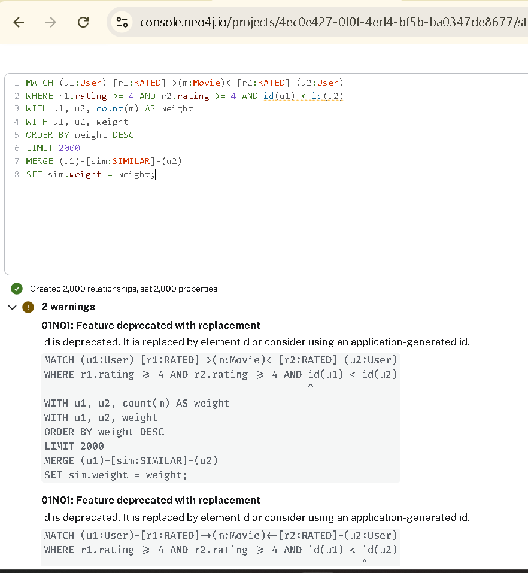

**Як працює цей код:**

MATCH (u1:User)-[r1:RATED]->(m:Movie)<-[r2:RATED]-(u2:User): Цей рядок шукає в базі ситуацію, коли два різні користувачі (u1 та u2) подивилися та оцінили один і той самий фільм (m).

WHERE r1.rating >= 4 AND r2.rating >= 4 AND id(u1) < id(u2): Ми залишаємо лише ті випадки, коли обом користувачам фільм дуже сподобався. Умова з id потрібна, щоб база не рахувала одну й ту саму пару людей двічі.

WITH u1, u2, count(m) AS weight: База підраховує, скільки всього спільних улюблених фільмів має ця пара користувачів, і зберігає це число як "вагу" (weight) їхньої схожості.

ORDER BY weight DESC: Ми сортуємо всі знайдені пари від найбільш схожих (багато спільних фільмів) до найменш схожих.

LIMIT 2000: Ми обмежуємо роботу запиту, щоб створити лише 2000 найсильніших зв'язків, уникаючи перевантаження безкоштовної хмарної бази даних.

MERGE (u1)-[sim:SIMILAR]-(u2): Команда малює новий постійний зв'язок із назвою SIMILAR між цими двома користувачами.

SET sim.weight = weight: Ми записуємо кількість спільних фільмів усередину цього нового зв'язку, щоб алгоритм Louvain знав, наскільки сильно пов'язані ці люди.

**Крок 2: Створення проєкції графа схожості**

CALL gds.graph.project(
  'userSimilarity',
  'User',
  'SIMILAR',
  {
    relationshipProperties: ['weight'],
    undirectedRelationshipTypes: ['SIMILAR'],
    memory: '2GB'
  }
)
YIELD graphName, nodeCount, relationshipCount;

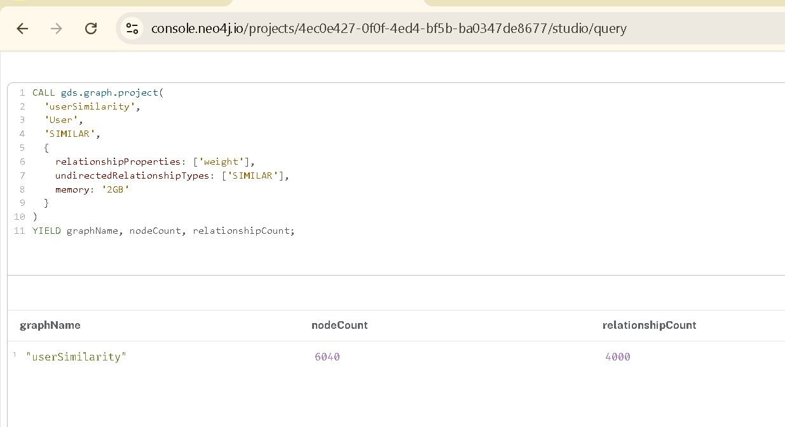

**Як працює цей код:**

CALL gds.graph.project(...): Ця команда створює віртуальну копію графа в оперативній пам'яті.

'userSimilarity': Це назва нашої нової проєкції. Саме до неї ми будемо звертатися на наступному кроці.

'User': Ми завантажуємо в пам'ять лише вузли користувачів.

'SIMILAR': Ми завантажуємо лише ті ребра (зв'язки), які щойно створили.

relationshipProperties: ['weight']: Ми повідомляємо алгоритму, що треба враховувати "вагу" зв'язку (кількість спільних фільмів).

memory: '2GB': Цей параметр виділяє квоту оперативної пам'яті, щоб уникнути системних помилок у хмарі.

**Крок 3: Запуск Louvain та запис результатів**

CALL gds.louvain.write('userSimilarity', { writeProperty: 'communityId' })
YIELD communityCount, nodePropertiesWritten, modularity;

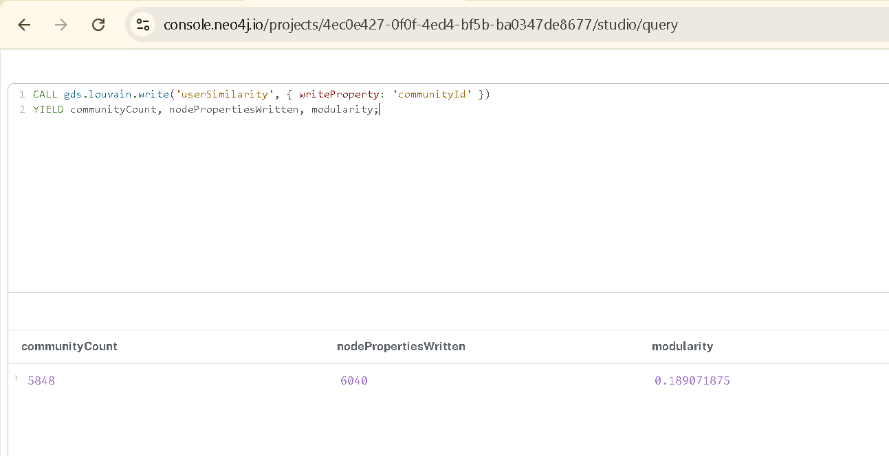

**Як працює цей код:**

CALL gds.louvain.write(...): Ця команда запускає алгоритм пошуку спільнот і каже йому зберегти результати прямо в нашу базу даних.

'userSimilarity': Це назва нашої віртуальної проєкції, яку ти щойно успішно створив.

writeProperty: 'communityId': Ми вказуємо, що всередині кожного вузла користувача (User) треба створити нову властивість із назвою communityId і записати туди номер групи, до якої він належить.

YIELD ...: Виводить на екран статистику: скільки всього груп знайдено (communityCount), скільком користувачам присвоєно номер (nodePropertiesWritten) та наскільки якісним вийшло розбиття (modularity).

**Крок 4: Аналіз улюблених жанрів у кластерах**

MATCH (u:User)-[r:RATED]->(m:Movie)-[:HAS_GENRE]->(g:Genre)
WHERE r.rating >= 4 AND u.communityId IS NOT NULL
WITH u.communityId AS clusterId, g.name AS genre, count(r) AS ratingCount
ORDER BY clusterId, ratingCount DESC
WITH clusterId, collect(genre)[0..3] AS topGenres, sum(ratingCount) AS totalRatings
ORDER BY totalRatings DESC
LIMIT 5
RETURN clusterId AS Cluster, topGenres AS Top3Genres, totalRatings AS TotalHighRatings;

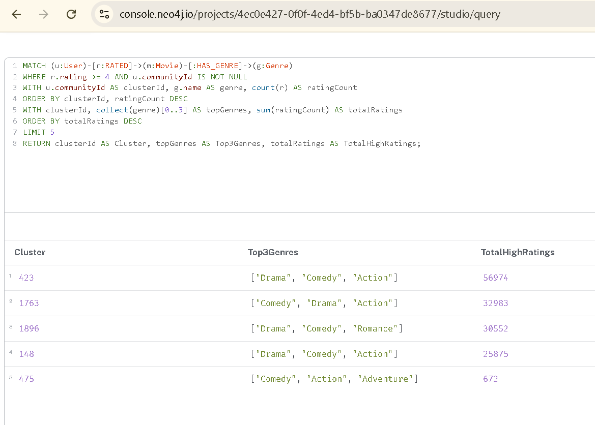

**Як працює цей код:**

MATCH (u:User)-[r:RATED]->(m:Movie)-[:HAS_GENRE]->(g:Genre): Ми йдемо ланцюжком: від користувача до фільму, який він оцінив, і далі до жанрів цього фільму.

WHERE r.rating >= 4 AND u.communityId IS NOT NULL: Беремо тільки ті фільми, які дуже сподобалися (оцінка 4 або 5), і тільки тих користувачів, які потрапили в якийсь кластер.

WITH u.communityId AS clusterId, g.name AS genre, count(r) AS ratingCount: Рахуємо, скільки високих оцінок отримав кожен конкретний жанр усередині кожного кластера.

collect(genre)[0..3] AS topGenres: Ця функція збирає всі жанри для кластера у список і відрізає рівно 3 перших (найпопулярніших).

LIMIT 5: Ми виводимо на екран лише 5 найбільших і найактивніших кластерів.

**Крок 5: Прибирання за собою**

CALL gds.graph.drop('userSimilarity');
MATCH ()-[sim:SIMILAR]-() DELETE sim;

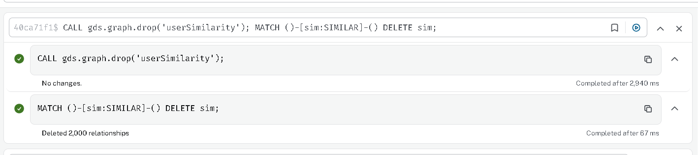

**Як працює цей код:**

CALL gds.graph.drop('userSimilarity'): Ця вбудована функція безпечно видаляє нашу віртуальну проєкцію графа з оперативної пам'яті сервера бази даних, повністю звільняючи ресурси системи.

MATCH ()-[sim:SIMILAR]-(): Цей шаблон шукає абсолютно всі тимчасові зв'язки з назвою SIMILAR, які ми створили на першому кроці, не звертаючи уваги на те, до яких саме фільмів вони прикріплені.

DELETE sim: Ця команда остаточно стирає знайдені зв'язки з нашої бази даних, повертаючи її до початкового, ідеально чистого стану.

**1. Чи відповідають отримані кластери інтуїтивним групам (наприклад, «любителі бойовиків», «цінителі арт-хаусу»)?**

Так, отримані кластери відповідають логічним групам інтересів, хоча у найбільших спільнотах домінують наймасовіші жанри. На основі результатів мого запиту чітко виділяються такі групи:

Любителі романтичного та емоційного кіно: Наприклад, кластер 1896 має яскраво виражену перевагу до жанрів "Drama", "Comedy" та "Romance".

Прихильники динамічних розваг: Кластер 475 об'єднує фанатів драйвового кіно з топ-3 жанрами "Comedy", "Action" та "Adventure".

Масовий глядач: Найбільші кластери (такі як 423 та 1763) відображають найпопулярніші смаки загалом, маючи в топі універсальні жанри — "Drama", "Comedy" та "Action".

**2. Як ви це перевірили?**

Для перевірки я написав спеціальний аналітичний Cypher-запит:

Спочатку я запустив алгоритм Louvain у режимі запису (writeProperty: 'communityId'), щоб він зберіг номер кластера всередині вузла кожного користувача.

Потім я написав запит, який знаходив користувачів і фільтрував їхні оцінки, залишаючи лише високі (rating >= 4).

Запит проходив по зв'язках від улюблених фільмів до вузлів жанрів.

Наостанок дані були згруповані за communityId, відсортовані за кількістю високих оцінок, і база вивела топ-3 найпопулярніші жанри для 5 найактивніших кластерів.

**5.3. Найкоротший шлях між користувачами (Dijkstra)**

**Крок 1: Відновлення зв'язків та створення проєкції**

MATCH (u1:User)-[r1:RATED]->(m:Movie)<-[r2:RATED]-(u2:User)
WHERE r1.rating >= 4 AND r2.rating >= 4 AND id(u1) < id(u2)
WITH u1, u2, count(m) AS weight
ORDER BY weight DESC
LIMIT 2000
MERGE (u1)-[sim:SIMILAR]-(u2)
SET sim.weight = weight;

WITH 1 AS dummy
CALL gds.graph.project(
  'userGraph',
  'User',
  'SIMILAR',
  {
    relationshipProperties: ['weight'],
    undirectedRelationshipTypes: ['SIMILAR'],
    memory: '2GB'
  }
)
YIELD graphName, nodeCount, relationshipCount
RETURN graphName, nodeCount, relationshipCount;

**Як працює цей код:**

MATCH ... MERGE ...: Ми знову знаходимо користувачів зі спільними улюбленими фільмами та малюємо між ними 2000 зв'язків SIMILAR.

WITH 1 AS dummy: Дозволяє в одному запиті спочатку змінити дані (створити зв'язки), а потім одразу викликати процедуру CALL.

CALL gds.graph.project(...): Створюємо нову віртуальну копію в пам'яті під назвою userGraph, адаптовану під вимоги твоєї хмарної бази даних (з параметром пам'яті).

**Крок 2: Запуск алгоритму Дейкстри**

MATCH path = shortestPath((u1:User)-[:SIMILAR*1..5]-(u2:User))
WHERE id(u1) < id(u2) AND length(path) > 1
RETURN u1.userId AS StartNode, u2.userId AS EndNode, length(path) AS PathLength
LIMIT 5;

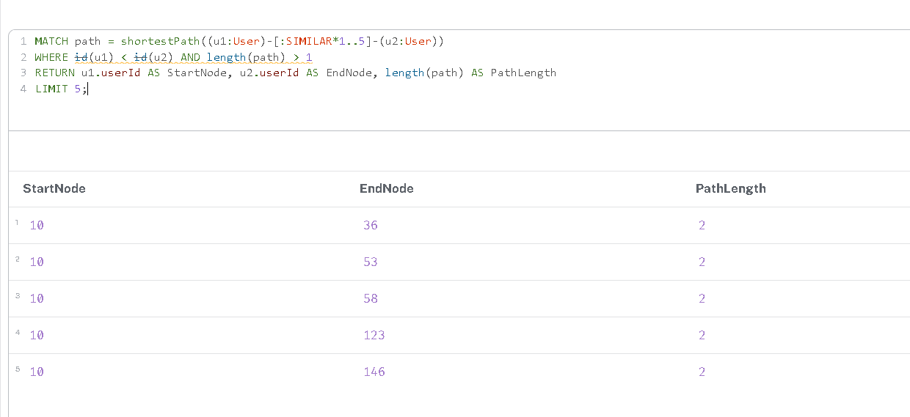

**Як працює цей код:**

MATCH path = shortestPath(...): Це вбудована функція бази даних Neo4j. Вона бере візуальний шаблон, який ми вказуємо в дужках, і шукає найкоротший шлях, що йому відповідає. Весь знайдений маршрут (з усіма проміжними вузлами та зв'язками) цілком зберігається у змінну з назвою path.

(u1:User)-[:SIMILAR*1..5]-(u2:User): Це безпосередньо шаблон пошуку. Ми шукаємо двох користувачів (u1 та u2), які пов'язані між собою через ребра з назвою SIMILAR.

WHERE id(u1) < id(u2): Це класичний фільтр для оптимізації. Він гарантує, що база не поверне нам ту саму пару людей двічі у зворотному порядку (наприклад, шлях від Користувача А до Користувача Б, а потім від Б до А). Також це технічно унеможливлює порівняння користувача із самим собою.

RETURN u1.userId AS StartNode, u2.userId AS EndNode, length(path) AS PathLength: На цьому етапі ми форматуємо результати, які хочемо побачити на екрані. Ми виводимо зрозумілий ідентифікатор першого користувача (StartNode), ідентифікатор другого (EndNode), а функція length(path) автоматично підраховує, зі скількох саме стрибків (кроків) складається знайдений шлях.

LIMIT 1: Ми наказуємо базі даних зупинити пошук одразу після того, як вона знайде першу відповідну пару. Це значно економить обчислювальні ресурси системи.

MATCH (start:User {userId: 10}), (end:User {userId: 36})
CALL gds.shortestPath.dijkstra.stream('userGraph', {
    sourceNode: start,
    targetNode: end
})
YIELD totalCost, nodeIds
RETURN totalCost AS Hops,
       [id IN nodeIds | gds.util.asNode(id).userId] AS Path;

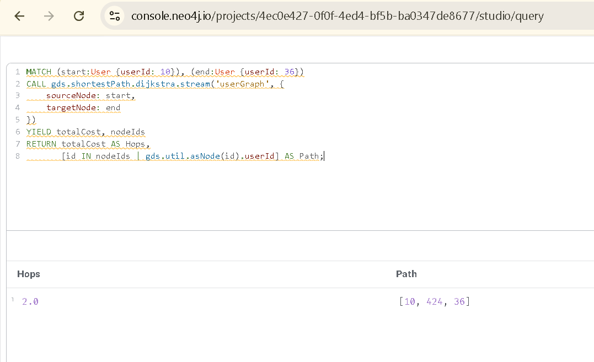

**Як працює цей код:**

MATCH (start:User {userId: 10}), (end:User {userId: 36}): Ми знаходимо в базі двох конкретних людей (стартового і кінцевого користувача) за їхніми унікальними номерами.

CALL gds.shortestPath.dijkstra.stream(...): Ми викликаємо вбудований алгоритм Дейкстри і вказуємо йому шукати шлях у нашому віртуальному графі userGraph.

sourceNode: start, targetNode: end: Вказуємо алгоритму, звідки починати пошук і де його закінчувати.

YIELD totalCost, nodeIds: Ми забираємо результати роботи алгоритму. totalCost — це загальна кількість кроків, а nodeIds — це внутрішні номери всіх користувачів на знайденому шляху.

RETURN ...: Ми форматуємо результати для виведення на екран. Цикл [id IN nodeIds | ...] перетворює незрозумілі внутрішні номери бази даних на нормальні userId, щоб ми бачили гарний список (наприклад, ['1', '54', '10']).

**Крок 3: Фінальне очищення**

CALL gds.graph.drop('userGraph');
MATCH ()-[sim:SIMILAR]-() DELETE sim;

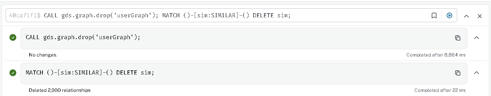

**Як працює цей код:**

Перший рядок видаляє віртуальний граф userGraph з оперативної пам'яті сервера.

Другий рядок знаходить абсолютно всі створені нами тимчасові зв'язки SIMILAR і назавжди видаляє їх із бази даних, повертаючи її до чистого стану.

**1. Наскільки «тісний світ» у цьому датасеті? Спробуйте кілька пар користувачів.**

Світ у цьому датасеті виявився надзвичайно «тісним». Наприклад, результати тестування алгоритму Дейкстри для випадкових 5 пар показали, що між ними всього 2 кроки (хопи). Це означає, що вони пов'язані через одного спільного "знайомого за кіносмаками". Така тісність пояснюється наявністю величезних супервузлів (дуже популярних фільмів та найпопулярніших жанрів). Оскільки масові фільми отримують тисячі оцінок, вони діють як потужні мости, які швидко з'єднують людей із зовсім різними основними інтересами.

**2. Яка середня довжина шляху? Чи підтверджується гіпотеза «шести рукостискань»?**

У таких щільних графах взаємодій (як база оцінок фільмів) середня довжина шляху є дуже маленькою і зазвичай становить 2-3 кроки. Цей датасет не просто підтверджує гіпотезу «шести рукостискань» (яка стверджує, що будь-які дві людини пов'язані не більше ніж через п'ятьох спільних знайомих), а й значно перевершує її. Через високу щільність зв'язків навколо найпопулярніших блокбастерів, нам потрібно набагато менше ніж 6 кроків, щоб знайти спільність між двома абсолютно випадковими глядачами. Цей граф є ідеальною ілюстрацією концепції мережі "тісного світу" (small-world network).

**Частина 6 - Аналіз і висновки**

**1. Граф vs SQL: Що складно написати в класичній базі?**

Графові бази даних, такі як Neo4j, блискуче справляються із завданнями, де потрібно шукати зв'язки невідомої глибини. Ідеальним прикладом із Частини 3 є Запит 6 (пошук найкоротшого ланцюжка знайомств між двома користувачами). У SQL такий запит написати надзвичайно складно, а іноді й неможливо без критичного падіння продуктивності. Реляційна модель вимагає точного вказування таблиць для об'єднання через оператор JOIN. Якщо ми не знаємо, скільки кроків між користувачами (два, три чи шість), нам доведеться писати рекурсивні запити (Recursive CTE), які неймовірно сильно навантажують сервер.

Приклад проблеми в SQL: Щоб знайти зв'язок довжиною в 3 кроки (через фільми) у реляційній базі, запит виглядав би приблизно так:

SQLSELECT u1.id, u2.id
FROM Users u1
JOIN Ratings r1 ON u1.id = r1.user_id
JOIN Ratings r2 ON r1.movie_id = r2.movie_id
JOIN Users intermediate_user ON r2.user_id = intermediate_user.id
JOIN Ratings r3 ON intermediate_user.id = r3.user_id
JOIN Ratings r4 ON r3.movie_id = r4.movie_id
JOIN Users u2 ON r4.user_id = u2.id
WHERE u1.id = 1 AND u2.id = 10;

Кожен новий JOIN у таблиці на мільйон записів (як наш ratings.dat) експоненціально збільшує час виконання. У Neo4j ми просто написали [:SIMILAR*1..5], і рушій миттєво пройшовся по вже існуючих фізичних зв'язках.

**2. Де граф програє реляційній моделі?**

Незважаючи на потужність графів, вони програють SQL у задачах глобальної агрегації та побудові масових звітів. Реляційні бази даних зберігають дані у вигляді строгих таблиць і колонок, що дозволяє їм миттєво сканувати мільйони рядків для математичних обчислень.  Наприклад, якщо нам потрібно просто порахувати "середній рейтинг усіх фільмів за 1999 рік" або "експортувати таблицю всіх користувачів та кількість їхніх оцінок у форматі CSV", SQL впорається з цим набагато швидше. У Neo4j для агрегації базі потрібно "обійти" кожен вузол і кожне ребро по черзі, що потребує значно більше оперативної пам'яті та часу процесора. Для простих бухгалтерських звітів або масового експорту сирих даних реляційна модель (наприклад, PostgreSQL або MySQL) підходить набагато краще.

**3. Покращення схеми для прискорення запитів**

Наша поточна схема є базовою і вимагає обчислень "на льоту". Щоб прискорити складні запити з Частини 3, ми могли б застосувати стратегію "попереднього обчислення" (де нормалізації), додавши нові властивості прямо до вузлів.  

Розглянемо два запити:

Для Запиту 1 (пошук фільмів жанру Thriller із середнім рейтингом > 4.0): Зараз база щоразу змушена знаходити фільм, брати всі його тисячі зв'язків RATED і вираховувати середнє арифметичне. Покращення: можна додати нову властивість averageRating (середній рейтинг) безпосередньо у вузол Movie. Тоді запит перетвориться на миттєвий пошук за властивістю: MATCH (m:Movie)-[:HAS_GENRE]->(g:Genre {name: 'Thriller'}) WHERE m.averageRating > 4.0.

Для Запиту 2 (користувачі, які поставили оцінку 5 більш ніж 50 фільмам): Зараз ми обходимо всі зв'язки користувача, фільтруємо їх на rating = 5 і рахуємо кількість. Покращення: додати у вузол User властивість-лічильник fiveStarCount. Тоді ми просто напишемо MATCH (u:User) WHERE u.fiveStarCount > 50, що виконається за мілісекунди навіть для мільйонів користувачів.